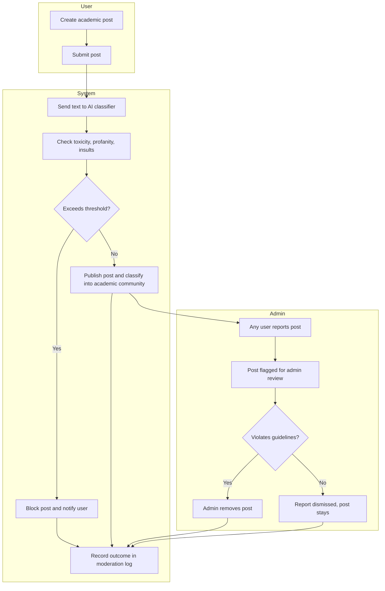

# Process Mapping — Content Moderation (AI + Human Review)

This process is **implemented** in SocioEcho for posts. Moderation of uploaded Resource Library documents is future scope.

## Process Flow

## Steps
1. A user submits an academic post.
2. The text is sent to the AI classifier (BART-large-MNLI), which checks for toxicity, profanity and insults.
3. If the post exceeds the threshold, it is blocked and the user is informed. Otherwise it is published and classified into an academic community.
4. Any user can report a published post. Reported posts are flagged for the administrator, who reviews them manually.
5. The administrator removes the post or dismisses the report.
6. All outcomes are recorded in the moderation logs.

## Business Rules
- BR-05: Every post is screened before it becomes visible.
- BR-06: Reported or flagged posts are reviewed manually by an administrator.
- BR-07: Moderation outcomes are logged.

## Design Decision: Hybrid Moderation
AI screening is fast and consistent but can misjudge context. Human review of reported posts handles cases the AI gets wrong. The literature survey in the project noted this trade-off between strict moderation and user experience.

## Model Selection (Option Analysis)
Candidate zero-shot classifiers were compared: BART-large-MNLI, RoBERTa-large-MNLI, DeBERTa-v3-large-MNLI and DistilBART-MNLI. BART-large-MNLI was chosen for its balance of accuracy, flexibility for zero-shot use and ease of deployment. DeBERTa scored slightly higher on benchmarks but needs more compute and runs slower.
*The benchmark scores come from the MNLI language-inference task. They are not the platform's measured moderation accuracy.*

## Gaps and Improvement Opportunities
- Extend AI screening to Resource Library uploads (project future scope).
- Track false positives (clean posts blocked) and false negatives (toxic posts reported later) as moderation KPIs.
- Allow users to appeal a blocked post.
