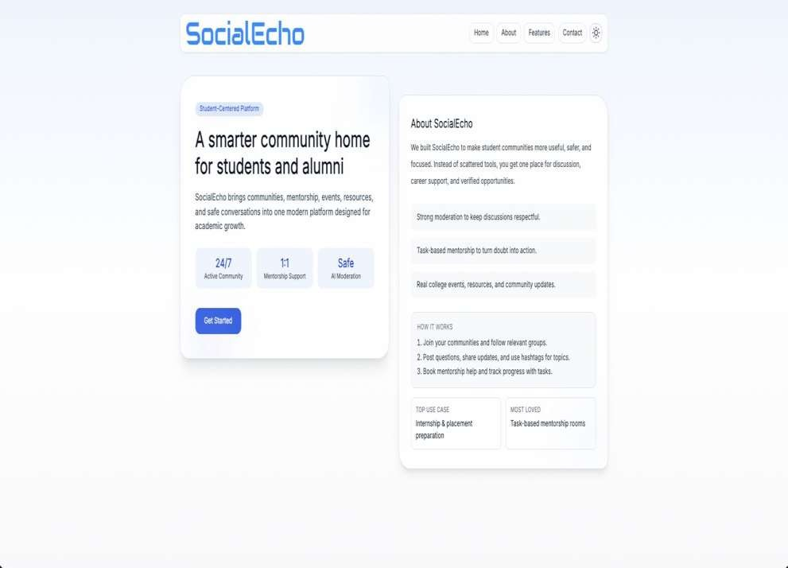
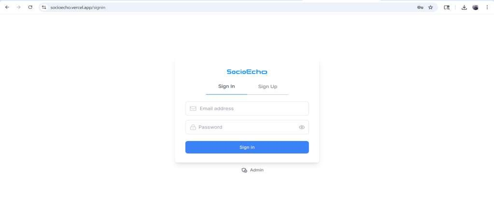
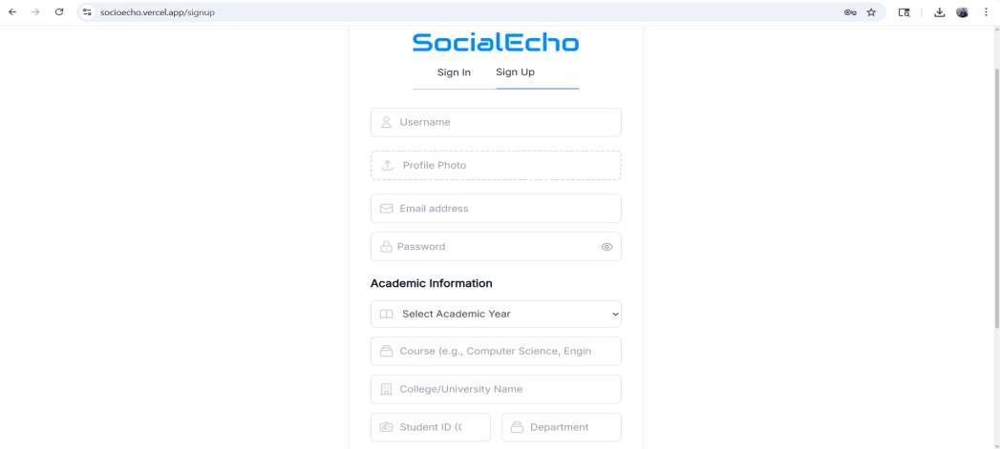
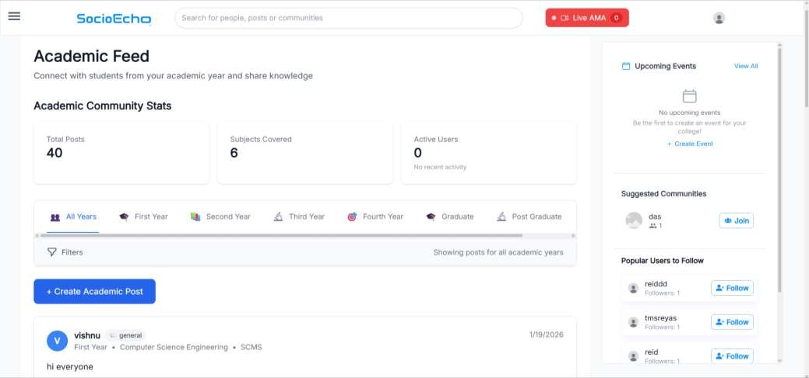
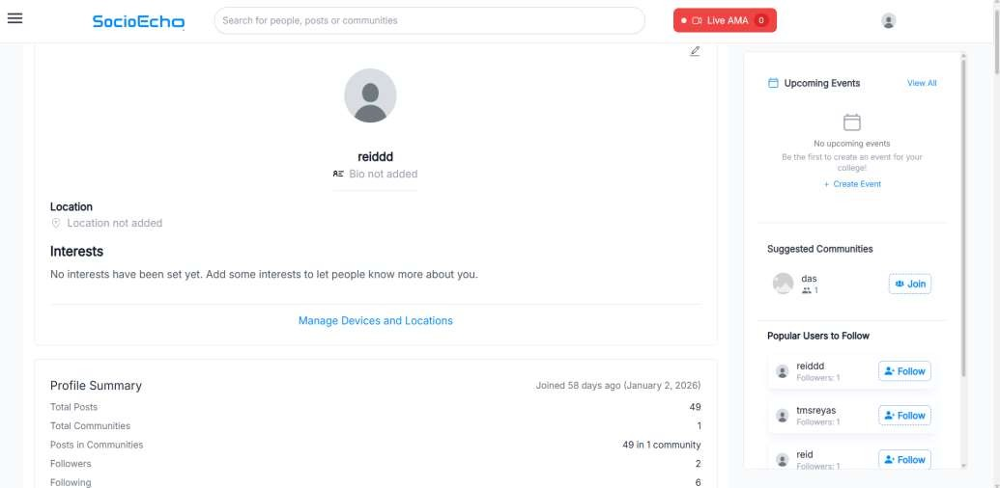
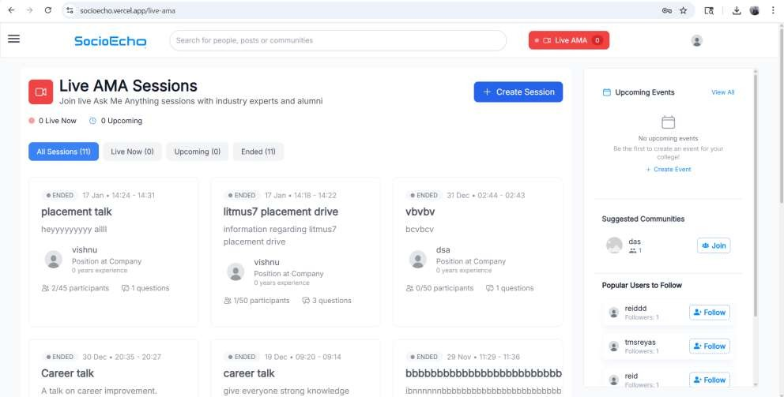
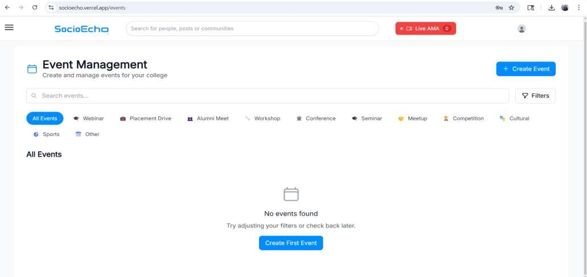
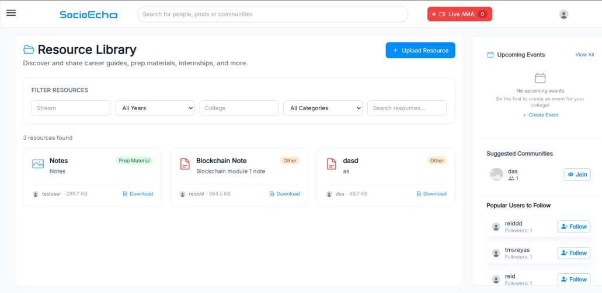

# Implementation Evidence — SocioEcho Screenshots

These screenshots come from the final-year project presentation. The hosted application is currently offline, so they are the available evidence that the features were built.

> **What these show:** the features existed in the running application. **What they do not show:** executed UAT results. The test cases in [UAT-Test-Cases.md](UAT-Test-Cases.md) have not been formally run. Screens for blocked posts and administrator review were not captured.

| # | Screenshot | Requirement | What it shows |
|---|------------|-------------|---------------|
| 1 | Landing page | BO-01, BO-06 | Platform overview: moderation, mentorship, events, resources |
| 2 | Login page | FR-13 | Sign-in screen |
| 3 | Sign-up page | FR-13 | Registration with username, email, password and academic details (year, course, college, student ID, department) |
| 4 | Academic feed | FR-01, FR-04, FR-05 | Posts by academic year, community stats, "Create Academic Post", follow suggestions |
| 5 | Profile page | FR-04 | Profile summary with followers and following counts |
| 6 | Live AMA sessions | FR-09 | Sessions with status (Live, Upcoming, Ended), participant limits and question counts, "Create Session" |
| 7 | Event management | FR-10 | Event categories (Webinar, Placement Drive, Alumni Meet and others) and "Create Event" |
| 8 | Resource Library | FR-08 | Upload, filters by stream/year/college/category, download, shared by users |

## Observations

- **Events (gap G-01):** the Event Management page offers "Create Event" and the side panel invites any viewer to "be the first to create an event". This is consistent with the finding that event creation is not restricted to organizers (see [CR-02](Change-Impact-Analysis.md)).
- **AMA sessions (FR-09):** participant limits (for example 2/45) and per-session question counts are visible, so the build covers more of US-04 than the case study first assumed.
- **Resource Library (FR-08):** uploaded items show the uploader's username, file size and category tag.
- **Mentorship rooms (FR-05, FR-15):** the landing page describes task-based mentorship rooms where users book help and track progress with tasks. No screenshot of a mentorship room was captured.
- **Suggestions panel:** "Suggested Communities" and "Popular Users to Follow" list available communities and popular users. They are not personalised, so FR-02 and FR-03 remain future scope.

---

### 1. Landing page

### 2. Login page

### 3. Sign-up page

### 4. Academic feed

### 5. Profile page

### 6. Live AMA sessions

### 7. Event management

### 8. Resource Library

