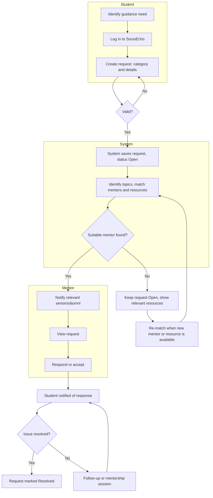

# Process Mapping — Mentorship Request

## To-Be Process Flow

## Primary Flow
1. Student identifies a guidance need and logs in.
2. Student creates a request with category and details (BR-01).
3. System validates and saves the request as **Open**.
4. System identifies topics and recommends relevant mentors and resources (FR-01 to FR-03).
5. Relevant seniors/alumni are notified and view the request (FR-07).
6. A mentor responds; the student is notified.
7. If resolved, the request is marked **Resolved**; otherwise the conversation continues through follow-up or a mentorship session (FR-09).

## Exception Flow: No Suitable Mentor
The request stays **Open**, the student is shown relevant resources, and the system re-matches when new mentors or resources become available. *The exact rule for an unmatched request (for example, how long it stays open) must be confirmed with stakeholders (OQ-01).*

## Request Status Lifecycle
`Open → Responded → Resolved` (or `Closed` if withdrawn or expired)

## Process Analysis
The flow separates the student's need, submission, matching, response and resolution into distinct steps. This gives a basis for requirement validation, measuring response time and resolution rate (BO-03, BO-04), and later change-impact analysis.
